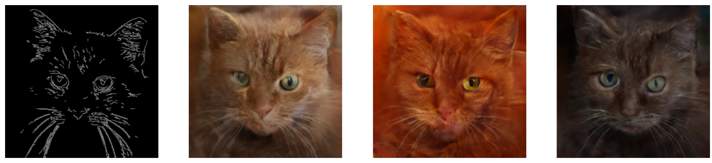

# ControlNet-In-Latent-Diffusion
This repository contains a manual implementation of ControlNet applied to an image generation model , Latent Diffusion Model (LDM), built entirely from scratch in PyTorch.

The model is trained to generate realistic cat images guided by **Canny Edge Maps**.

|||
| :---: | :---: |
| **Unconditional Image Generation** | **Prompt : A cute orange cat with green eyes** |

## Architecture
```
Z : Noisy Latent , time embedding
X : A copy of z
C : Condition , cat's canny map were used in this training
Blue Block : Freeze during training
Green Block: Trainable
```
<p>
  
</p>

## Pre-trained Latent Diffusion 

This repo applied ControlNet on previous prebuilt Latent Diffusion Model from Scratch 

[Latent Diffusion From Scratch](https://github.com/Yang-star-source/Latent_Diffusion_From_Scratch)

## Codes Implementation
For training code :

[](https://colab.research.google.com/github/Yang-star-source/ControlNet-In-Latent-Diffusion/blob/main/ControlNet_In_Latent_Diffusion_Training.ipynb)

For Inference Mode (One Click Run Ctrl+F9):

[](https://colab.research.google.com/github/Yang-star-source/ControlNet-In-Latent-Diffusion/blob/main/ControlNet_In_Latent_Diffusion_Inference_Mode.ipynb)

## Dataset 
If you use this dataset in your research, please credit the authors

```bibtex
@inproceedings{choi2020starganv2,
  title={StarGAN v2: Diverse Image Synthesis for Multiple Domains},
  author={Yunjey Choi and Youngjung Uh and Jaejun Yoo and Jung-Woo Ha},
  booktitle={Proceedings of the IEEE Conference on Computer Vision and Pattern Recognition},
  year={2020}
}
```

[Dataset from Kaggle](https://www.kaggle.com/datasets/andrewmvd/animal-faces)

[CATS , CANNY AND LATENTS](https://huggingface.co/datasets/ziyang06315/cats_images_dataset/tree/main)

## Reference
If you used the ideas from ControlNet in this project, please cite the original paper:

```bibtex
@inproceedings{zhang2023adding,
  title={Adding Conditional Control to Text-to-Image Diffusion Models},
  author={Zhang, Lvmin and Rao, Anyi and Agrawala, Maneesh},
  booktitle={Proceedings of the IEEE/CVF International Conference on Computer Vision},
  pages={3836--3847},
  year={2023}
}
```

[OpenCV Edge Detection](https://docs.opencv.org/3.4/da/d22/tutorial_py_canny.html)
