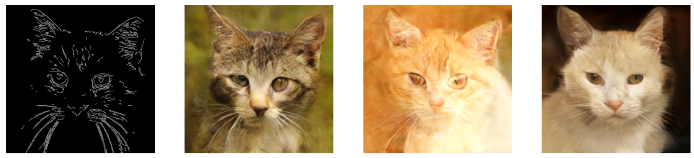

# ControlNet-In-Latent-Diffusion
Apply ControlNet on Latent Diffusion is to guide model to generate desired style of images. The condition used in this repo is Canny Map which generate by OpenCV edge detection.

<p>
  
  
  
</p>

## Architecture
```
**Z** : Noisy Latent , time embedding
**X**: a copy of z
**C** : condition , cat's canny map were used in this training
**Blue Block** : Freeze during training
**Green Block**: Trainable
```
<p>
  
</p>

## Pre-trained Latent Diffusion (Unconditional)

This repo applied ControlNet on previous prebuilt Latent Diffusion from Scratch (Unconditional)

[Latent Diffusion From Scratch](https://github.com/Yang-star-source/Latent_Diffusion_From_Scratch)

## Codes Implementation
For training code :

[](https://colab.research.google.com/github/Yang-star-source/ControlNet-In-Latent-Diffusion/blob/main/ControlNet_In_Latent_Diffusion_Training.ipynb)

For Inference Mode (One Click Run Ctrl+F9):

[](https://colab.research.google.com/github/Yang-star-source/ControlNet-In-Latent-Diffusion/blob/main/ControlNet_In_Latent_Diffusion_Inference_Mode.ipynb)

## Dataset 
```bibtex
@inproceedings{choi2020starganv2,
  title={StarGAN v2: Diverse Image Synthesis for Multiple Domains},
  author={Yunjey Choi and Youngjung Uh and Jaejun Yoo and Jung-Woo Ha},
  booktitle={Proceedings of the IEEE Conference on Computer Vision and Pattern Recognition},
  year={2020}
}
```

[Dataset from Kaggle](https://www.kaggle.com/datasets/andrewmvd/animal-faces)

[CATS , CANNY AND LATENTS](https://huggingface.co/datasets/ziyang06315/cats_images_dataset/tree/main)

## Reference

```bibtex
@inproceedings{zhang2023adding,
  title={Adding Conditional Control to Text-to-Image Diffusion Models},
  author={Zhang, Lvmin and Rao, Anyi and Agrawala, Maneesh},
  booktitle={Proceedings of the IEEE/CVF International Conference on Computer Vision},
  pages={3836--3847},
  year={2023}
}
```
